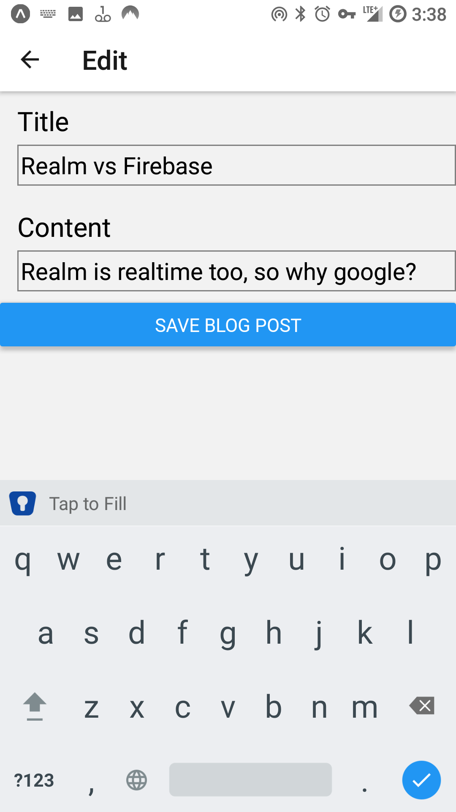
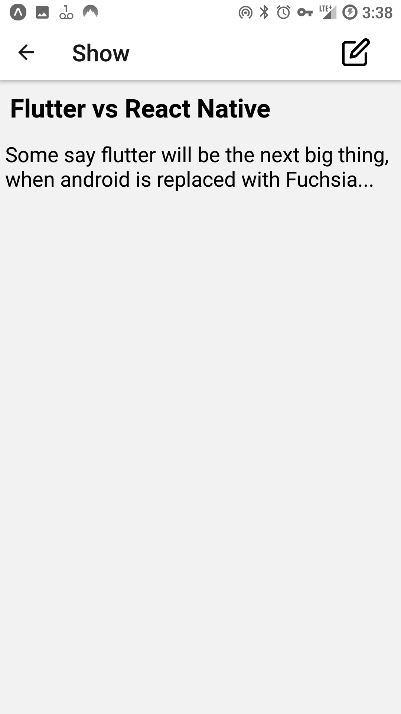
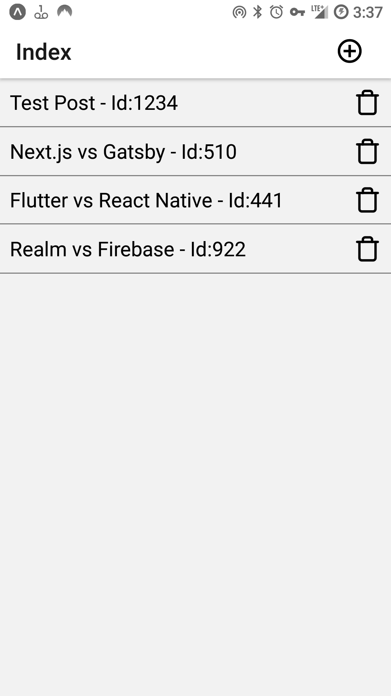

# Blog  App

This react native app allows you to create new blog posts by pressing the "+" button. Each entry has a title and content property. Posts can be edited by clicking on the post, and pressing the "pencil" button. A form is shown while editing, which contains `TextInput` elements and a submit button. 

## Technical Features

- Uses react-navigation to manage various screens: Index, Show, Create & Edit.
- Uses the "Provider and Context" scheme to pass functions and state across components at any level. (Basically, like recreating the functionality of Redux)
- Uses a reducer function to manage state. It handles three action types: addBlogPost, deleteBlogPost, and editBlogPost.
- Context and Provider objects are created using a function for `{Context, Provider} = createContext(reducer,{...actions},initialState)` . This approach makes the creation of additional contexts & providers more easily.
- Each post receives a randomly-generated unique ID, which is passed to a `FlatList` element, in Index screen.
- The `Create` and `Edit` screens reuse the component `BlogPostForm`, which is destructured from the `Context`. They then assign either the `addBlogPost` or `editBlogPost` functions to the Submit button. (Also descructured from `Context`)
  - These functions then pass the appropriate action types and payloads to the dispatch function, based on the local state from the form's `TexInput` elements. (title & content)

## Screenshots

